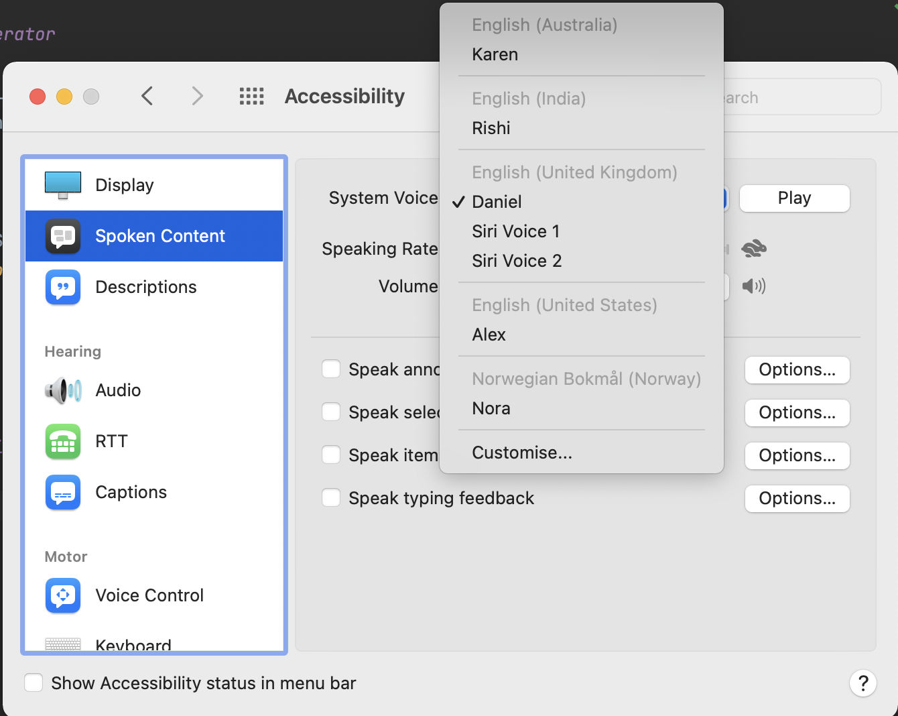

# Random Drinking Generator

This repository contains the code to generate a random amount of sips to be had for a randomly
selected person and announce it aloud.

## Prerequisites

- Only works on Mac OSX
- [Node.js](https://nodejs.org/en/#home-downloadhead) must be installed

## Running the code

Run `yarn start` in a terminal.

## Customising the voice used

System Preferences => Accessibility => Spoken Content:

